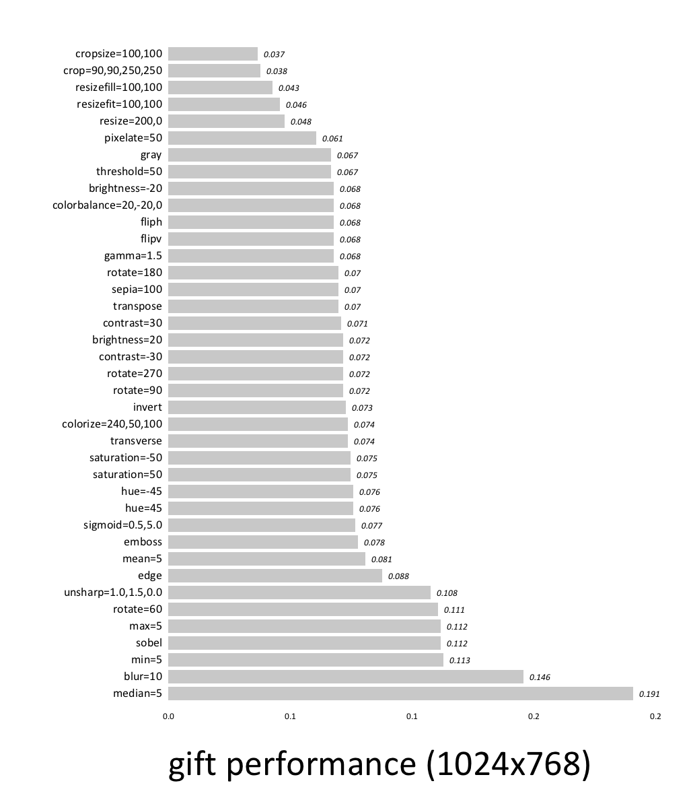

gift
====

Command line interface to the [Go Image Filtering Toolkit](https://github.com/disintegration/gift)

Install
===

    go get github.com/ajstarks/gift
    
Usage
===

gift reads either from a single file (PNG or JPEG) or standard input and always writes to standard output:

    gift -contrast 80 foo.jpg > contrast.jpg
    gift -flipv < foo.png > flipped.png
    
Filters can be combined.  For example to blur and invert:

    gift -invert -blur 4 foo.jpg > inverted-blurred.jpg
		
Here are the command flags:
```
   -blur float
    	blur value
  -brightness float
    	brightness value (-100, 100) (default -200)
  -colorbalance string
    	color balance (%red, %green, %blue)
  -colorize string
    	colorize (hue, saturation, percentage)
  -contrast float
    	contrast value (-100, 100) (default -200)
  -crop string
    	crop x1,y1,x2,y2
  -cropsize string
    	crop w h
  -edge
    	edge filter
  -emboss
    	emboss
  -fliph
    	flip horizontal
  -flipv
    	flip vertical
  -gamma float
    	gamma value
  -gray
    	grayscale
  -hue float
    	hue value (-180, 180) (default -200)
  -invert
    	invert
  -max int
    	local maximum (kernel size)
  -mean int
    	local mean filter (kernel size)
  -median int
    	local median filter (kernel size)
  -min int
    	local minimum (kernel size)
  -pixelate int
    	pixelate
  -resize string
    	resize w,h
  -resizefill string
    	resizefill w,h
  -resizefit string
    	resizefit w,h
  -rotate int
    	rotate specified degrees counter-clockwise
  -saturation float
    	saturation value (-100, 500) (default -200)
  -sepia float
    	sepia percentage (0-100) (default -1)
  -sigmoid string
    	sigmoid contrast (midpoint,factor)
  -sobel
    	sobel filter
  -threshold float
    	color threshold percentage (0-100) (default -1)
  -transpose
    	flip horizontally and rotate 90° counter-clockwise
  -transverse
    	 flips vertically and rotate 90° counter-clockwise
  -unsharp string
    	unsharp mask (sigma,amount,threshold)
```

See testgift.sh for typical usage

Performance
===

Processing a 1024x768 JPEG image on a 2013 Macbook Pro, 2.3 GHz Intel Core i7, under Mac OS 10.13



